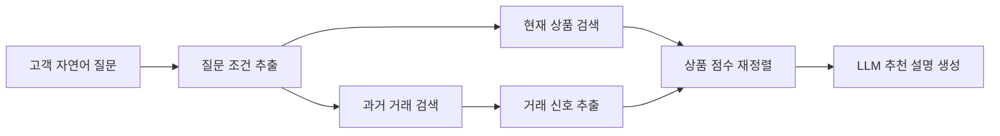
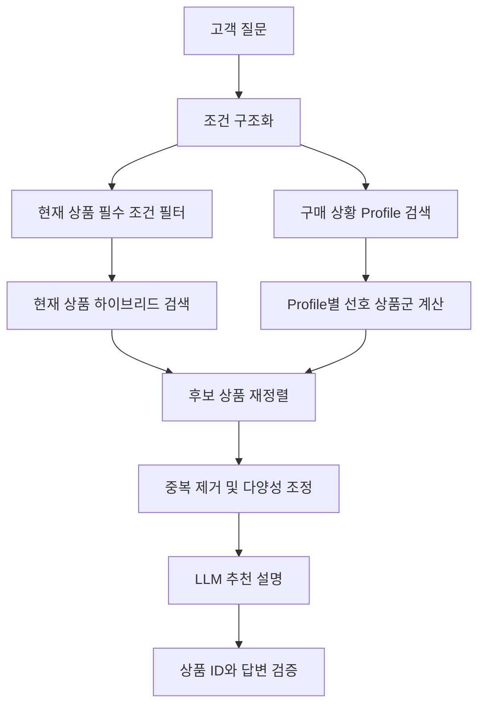

# 기프트코 상품 추천 RAG 학습 프로젝트

과거 거래데이터와 현재 상품데이터를 활용하여, 고객의 자연어 요청에 맞는 판촉물을 추천하는 RAG 기반 상품 추천 시스템을 단계적으로 구현한 학습 프로젝트입니다.

이 프로젝트는 운영용 완성 시스템을 한 번에 만드는 것이 아니라, 각 버전에서 하나의 문제를 확인하고 다음 버전에서 개선 가설을 실험하는 방식으로 진행합니다.

```text
v0: 기본 검색·추천 파이프라인 구현
 ↓
v1: 질문 구조화 및 거래 Row 임베딩 검색
 ↓
v2: 반복 거래를 Profile 단위로 집계하여 검색
 ↓
v3: 현재 상품 중심 검색 + 개선 Profile 재정렬 + 평가 체계 구축 예정
```

> 이 저장소의 노트북 파일은 RAG 구조를 학습하고 비교하기 위한 실험 단계입니다.  
> 실제 서비스 적용 전에는 상품 판매상태, 가격, MOQ, 납기, 재고, 인쇄 가능 여부 등에 대한 추가 검증이 필요합니다.

---

## 1. 프로젝트 배경

판촉물 고객은 상품명을 직접 입력하기보다 다음과 같이 구매 목적과 상황을 중심으로 문의하는 경우가 많습니다.

```text
병원 개원 답례품으로 3천 원 이하 500개 추천해줘
대학생 OT에서 나눠줄 실용적인 기념품이 필요해
8월 야외 행사에 어울리는 여름 판촉물을 추천해줘
VIP 고객에게 줄 고급스러운 선물을 찾고 있어
```

단순 상품명 검색만으로는 다음 조건을 함께 고려하기 어렵습니다.

- 구매처 유형
- 행사와 구매 목적
- 사용 대상
- 계절과 행사 시기
- 예산
- 요청수량과 최소구매수량
- 과거 유사 구매 사례

이 프로젝트에서는 현재 상품데이터를 검색하고 과거 거래데이터를 추천 근거로 활용하는 RAG형 상품 추천 구조를 실험합니다.

---

## 2. RAG 적용 방식

일반적인 문서 질의응답 RAG와 달리, 이 프로젝트는 상품 추천에 맞게 검색·재정렬·생성을 결합합니다.

### Retrieval

- 고객 질문과 관련 있는 현재 상품 검색
- 고객 상황과 유사한 과거 거래 또는 거래 Profile 검색

### Augmentation

- 구매처, 행사, 대상, 계절, 예산, 수량 조건 추출
- 유사 거래에서 자주 등장한 상품분류와 구매 패턴 추출

### Ranking

- 질문과 상품의 관련도
- 거래 패턴과 상품의 관련도
- 카테고리 일치
- 예산과 MOQ 조건
- 시기 적합도 등을 결합하여 상품 재정렬

### Generation

- 검색과 재정렬로 선정된 상품을 LLM에 전달
- 상품별 추천 이유와 추가 확인사항을 자연어로 생성



---

## 3. 버전 발전 과정

| 버전 | 핵심 실험 | 이전 버전에서 개선한 내용 | 새롭게 확인된 문제 |
|---|---|---|---|
| v0 | 기본 검색·추천 흐름 | 최초 버전 | 질문 구조화 부족, 거래 문맥 활용 제한 |
| v1 | 거래 Row 임베딩 검색 | 질문 구조화, 거래 전체 문맥 검색, 행사월·주문월 보정 | 반복 Row, 거래 신호 혼합, 검색 규모 증가 |
| v2 | 거래 Profile 임베딩 검색 | 반복 거래 집계, 거래 건수 활용, 검색 단위 축소 시도 | Profile 기준 과세분화, Profile 관계 손실 |

---

# 4. v0 — 기본 검색·추천 파이프라인

파일:

```text
giftco_product_recommendation_v0.ipynb
```

## 4.1 학습 목표

v0에서는 상품 추천 RAG를 구성하는 전체 흐름을 처음부터 끝까지 연결하는 데 집중했습니다.

```text
사용자 질문
→ 상품 검색
→ 과거 거래 검색
→ 거래 카테고리 힌트 추출
→ 상품 점수 보정
→ LLM 답변 생성
```

주요 구현 내용:

- 상품·거래 엑셀 로딩 및 전처리
- 검색용 텍스트 생성
- 질문에서 예산과 수량 조건 추출
- 상품 검색과 거래 검색 결합
- 추천 결과 엑셀 저장
- Ollama를 이용한 고객용 답변 생성

## 4.2 확인된 문제

### 질문을 구조화된 조건으로 충분히 분리하지 못함

다음 질문에는 여러 조건이 포함되어 있습니다.

```text
병원 개원 답례품으로 3천 원 이하 500개 추천해줘
```

필요한 구조:

```text
구매처: 병원
행사: 개원
목적: 답례품
예산: 3,000원
수량: 500개
```

v0에서는 주로 예산과 수량처럼 규칙으로 추출하기 쉬운 일부 조건을 중심으로 처리했습니다.

### 거래데이터를 단순 카테고리 힌트로 사용함

과거 거래에서 `생활용품`, `문구용품` 등의 분류만 추출하면 구매처·행사·상품 간 연결 관계가 약해집니다.

```text
병원 → 위생용품
대학교 → 문구용품
기업 행사 → 타월
```

위 관계가 최종적으로 다음처럼 단순 목록으로 바뀔 수 있습니다.

```text
위생용품, 문구용품, 타월
```

### 행사 시기와 실제 주문 시기의 차이를 반영하지 않음

8월 행사 상품은 8월이 아니라 6~7월에 주문되는 경우가 있습니다. v0에서는 행사 시기와 주문 리드타임을 별도로 고려하지 않았습니다.

### 필수 조건과 추천 점수의 구분이 부족함

예산과 MOQ가 추천 점수 일부로만 반영되면, 다른 점수가 높은 상품이 조건을 초과해도 상위 결과에 남을 수 있습니다.

### LLM이 부정확한 후보를 자연스럽게 설명할 수 있음

검색 후보가 실제 요구와 맞지 않더라도 LLM이 그럴듯한 추천 이유를 생성할 수 있습니다. 검색과 생성의 역할을 더 엄격하게 분리할 필요가 있습니다.

## 4.3 v1에서 실제로 보완한 내용

- 질문을 구매처·행사·목적·예산·수량 등으로 구조화
- 거래 한 행 전체를 검색 문맥으로 사용
- 상품과 거래에 문장 임베딩 적용
- 행사월과 실제 참고 주문월 분리
- 검색 점수와 고객용 답변 생성을 구분

## 4.4 v1에서도 남은 문제

- 가격과 MOQ를 강제 필터로 전환하지 못함
- 관련성이 낮은 거래를 제외하는 최소 기준 부족
- 여러 거래의 정보를 합치는 과정에서 관계 정보 손실
- LLM 답변에 허용된 상품만 포함되는지 검증 부족

---

# 5. v1 — 거래 Row 단위 임베딩 검색

파일:

```text
giftco_product_recommendation_v1.ipynb
```

## 5.1 학습 목표

v1에서는 과거 거래 한 건을 하나의 검색 문서로 보고, 고객 질문과 의미가 유사한 거래 사례를 찾는 구조를 구현했습니다.

```text
거래 1행
→ 검색용 텍스트 1개
→ 임베딩 1개
```

주요 구현 내용:

- `bge-m3` 기반 상품·거래 임베딩
- LLM과 정규식 기반 질문 조건 추출
- 상품·거래 임베딩 캐시
- 행사월 기준 참고 주문월 가중치
- 유사 거래 Row 검색
- 거래 신호와 상품 신호를 결합한 재정렬
- Ollama 기반 추천 답변 생성

## 5.2 v0에서 개선한 내용

### 질문 조건 구조화

```json
{
  "buyer_context": "병원",
  "event_context": "개원",
  "purpose": "답례품",
  "budget_max": 3000,
  "quantity": 500
}
```

질문을 하나의 문자열로만 검색하지 않고, 구조화된 조건을 추천 점수에 활용할 수 있도록 확장했습니다.

### 거래 전체 문맥 활용

v0의 단순 카테고리 힌트에서 다음과 같은 거래 전체 문맥으로 확장했습니다.

- 구매처
- 주문월
- 상품명
- 상품분류
- 행사
- 대상
- 시즌
- 인쇄방법

### 행사월과 주문월 분리

행사 시점보다 먼저 상품을 주문하는 판촉물 구매 특성을 반영하기 위해 참고 주문월 가중치를 추가했습니다.

### 검색과 생성 역할 분리

- Python: 검색, 점수 계산, 추천 후보 선정
- LLM: 선정된 상품의 추천 이유 설명

## 5.3 새롭게 확인된 문제

### 반복 거래가 검색 결과를 차지할 수 있음

거래 한 행씩 검색하기 때문에 비슷한 거래가 반복되면 상위 결과가 동일한 패턴으로 채워질 수 있습니다.

```text
대학교 / OT / 텀블러
대학교 / OT / 텀블러
대학교 / OT / 텀블러
대학교 / OT / 보조배터리
```

### 거래데이터가 증가하면 검색 단위도 함께 증가함

거래가 5만 건이면 임베딩 검색 대상도 5만 개가 됩니다. 학습 단계에서는 가능하지만 전체 데이터 적용 시 검색 효율과 중복 문제가 커질 수 있습니다.

### 날짜 점수가 의미 관련도를 밀어낼 수 있음

같은 시기에 주문되었다는 이유만으로 고객 목적과 직접 관련이 낮은 거래가 상위에 올라올 수 있습니다.

### 여러 거래의 연결 관계가 다시 사라짐

거래 검색 단계에서는 각 Row의 문맥이 유지되지만, 여러 거래에서 추출한 구매처·행사·상품분류를 하나의 `signal_text`로 합치면 관계가 다시 약해집니다.

```text
병원 + 개원 → 타월
대학교 + OT → 보조배터리
```

합쳐진 텍스트:

```text
병원 대학교 개원 OT 타월 보조배터리
```

### 과거 거래 신호가 고객 질문보다 강해질 수 있음

거래 관련 점수의 비중이 높으면 고객이 현재 요청한 조건보다 과거 인기 상품이 추천을 더 강하게 이끌 수 있습니다.

### 현재 추천 상품과 과거 거래 상품을 LLM이 혼동할 수 있음

LLM에 현재 상품 후보와 과거 거래 상품명이 함께 전달되면, 과거 거래 상품을 현재 추천 상품처럼 답변에 포함할 가능성이 있습니다.

## 5.4 v2에서 실제로 보완한 내용

- 반복되는 거래 Row를 Profile 단위로 집계
- Profile별 거래 건수 생성
- 거래 패턴 자체를 검색 단위로 사용
- 전체 거래 Row보다 검색 단위를 줄일 수 있는 구조 실험
- 개별 거래가 아닌 반복 구매 패턴을 추천 근거로 활용

## 5.5 v2에서도 남은 문제

- Profile별 관계를 최종 상품 점수까지 유지하지 못함
- 가격·MOQ·판매상태 필터 미적용
- 과거 거래 신호와 현재 상품 후보의 역할 혼재
- 관련도 임계값과 정량 평가체계 부족

---

# 6. v2 — 거래 Profile 단위 임베딩 검색

파일:

```text
giftco_product_recommendation_v2.ipynb
```

## 6.1 학습 목표

v2에서는 v1의 Row 반복 문제를 줄이기 위해 비슷한 거래를 하나의 Profile로 묶어 검색합니다.

```text
유사 거래 여러 행
→ 거래 Profile 1개
→ Profile 임베딩 1개
```

주요 구현 내용:

- 거래 Row 전처리
- 구매처·상품분류·시기·행사·대상 기준 Profile 생성
- Profile별 거래 건수 집계
- 대표 상품과 대표 구매처 생성
- Profile 임베딩 검색
- Profile 신호 기반 현재 상품 재정렬

## 6.2 v1에서 개선한 내용

### 반복 거래 집계

동일하거나 유사한 거래 패턴을 Profile로 묶어 반복 Row가 검색 결과를 차지하는 문제를 줄이려 했습니다.

### 거래 건수를 패턴 신뢰도로 활용

Row 방식에서는 반복 거래가 단순한 중복으로 보였지만, Profile 방식에서는 거래 건수를 별도 값으로 활용할 수 있습니다.

```text
병원 / 개원 Profile: 320건
대학교 / OT Profile: 180건
기업 / 박람회 Profile: 75건
```

### 검색 단위 축소 실험

Profile이 적절하게 묶인다면 전체 거래 Row보다 적은 임베딩으로 검색할 수 있습니다.

## 6.3 새롭게 확인된 문제

### Profile 그룹 기준이 너무 세밀함

구매처 세분류, 상품 대·중·소분류, 주문월, 행사, 대상, 시즌이 모두 같아야 같은 Profile이 될 경우 거래가 충분히 묶이지 않을 수 있습니다.

Profile 생성 후 반드시 다음 지표를 확인해야 합니다.

- 원본 거래 수
- Profile 수
- Profile 감소율
- Profile당 평균 거래 수
- 1건 Profile 비율
- 5건 이상 Profile 비율

### 상품분류가 Profile 그룹 키에 포함됨

다음 거래가 서로 다른 Profile로 분리됩니다.

```text
병원 + 개원 + 타월
병원 + 개원 + 텀블러
병원 + 개원 + 칫솔세트
```

그러나 상품 추천에서 확인하고 싶은 것은 다음과 같습니다.

```text
병원 개원 상황에서 어떤 상품군이 많이 선택되었는가?
```

상품분류는 그룹 기준이 아니라 Profile 내부 결과 분포로 집계하는 것이 더 적절할 수 있습니다.

### 대표상품이 거래 빈도순이 아님

원본 데이터에 먼저 등장한 상품을 대표상품으로 사용하면 실제로 많이 주문된 상품과 대표상품이 다를 수 있습니다.

### 여러 Profile을 하나의 신호 텍스트로 합침

Profile을 만들었더라도 검색 후 여러 Profile 정보를 하나의 텍스트로 합치면 구매처·행사·상품의 연결 관계가 다시 사라집니다.

### 거래량이 여러 단계에서 반복 반영될 수 있음

거래량을 Profile 검색, 신호 추출, 상품 최종 점수에서 반복 사용하면 기존 인기 패턴의 영향이 지나치게 커질 수 있습니다.

### Profile 중앙가격과 MOQ의 대표성 부족

하나의 Profile에 서로 다른 가격과 MOQ를 가진 상품이 포함되어 있다면 Profile 중앙값은 특정 상품의 실제 구매 조건이 아닙니다.

## 6.4 다음 버전에서 보완할 방향

- 상품분류를 Profile 그룹 키에서 제거
- 구매처·행사·대상·시즌 중심의 구매 상황 Profile 생성
- Profile 내부에 상품분류별 거래 건수와 비율 저장
- 대표상품을 거래 빈도순으로 생성
- Profile별 상품 신호를 개별적으로 현재 상품 점수에 누적
- 가격·MOQ·판매상태는 현재 상품데이터 기준으로 필터링
- Profile 감소율과 추천 정확도를 함께 평가

---

# 7. 현재 데이터 구성

노트북은 다음 경로의 샘플 데이터를 기본으로 사용합니다.

```text
data/
├── 상품데이터_샘플100.xlsx
└── 거래데이터_샘플100.xlsx
```

## 상품데이터 주요 항목

- 상품번호
- 상품명
- 브랜드
- 판매가
- 최소구매수량
- 상품분류 대·중·소
- 검색키워드
- 간략한 설명
- 상세 상품내용
- 제조사
- 원산지
- 이미지 또는 상품 URL

## 거래데이터 주요 항목

- 구매처 분류
- 구매처명
- 주문일자
- 상품명
- 상품분류 대·중·소
- 대량·중간·소량 가격
- 최소구매수량
- 행사
- 대상
- 시즌
- 인쇄방법
- 비고

> 실제 거래데이터를 공개 저장소에 올릴 경우 고객명, 연락처, 담당자명 등 개인정보와 영업정보를 반드시 제거해야 합니다.

---

# 8. 폴더 구조

```text
product-recommendation/
├── README.md
├── notebooks/
│   ├── giftco_product_recommendation_v0.ipynb
│   ├── giftco_product_recommendation_v1.ipynb
│   └── giftco_product_recommendation_v2.ipynb
├── docs/
│   └── giftco_product_recommendation_RAG_문제점_및_보완방향.md
├── data/
│   ├── 상품데이터_샘플100.xlsx
│   └── 거래데이터_샘플100.xlsx
├── output/
├── cache/
└── .gitignore
```

공개 저장소에서는 실제 원본 거래데이터 대신 익명화된 소규모 샘플만 포함하는 것을 권장합니다.

---

# 9. 실행 환경

## 권장 환경

- Python 3.11
- Jupyter Notebook 또는 JupyterLab
- Ollama
- pandas
- NumPy
- scikit-learn
- openpyxl
- ollama Python package

## Python 패키지 설치

```bash
pip install pandas numpy scikit-learn openpyxl jupyter ollama
```

## Ollama 모델 준비

v1과 v2의 기본 설정:

```text
임베딩 모델: bge-m3
LLM 모델: gemma3:4b
```

```bash
ollama pull bge-m3
ollama pull gemma3:4b
```

Ollama 모델이 준비되지 않으면 일부 검색 단계에서 TF-IDF fallback이 사용될 수 있으며, 질문 구조화와 최종 답변 생성은 제한될 수 있습니다.

---

# 10. 실행 방법

1. 저장소를 내려받습니다.
2. Python 환경을 생성하고 필요한 패키지를 설치합니다.
3. Ollama를 실행하고 모델을 내려받습니다.
4. `data/` 폴더에 상품·거래 샘플 파일을 배치합니다.
5. 버전 순서대로 노트북을 실행합니다.

권장 실행 순서:

```text
1. giftco_product_recommendation_v0.ipynb
2. giftco_product_recommendation_v1.ipynb
3. giftco_product_recommendation_v2.ipynb
```

각 버전의 결과를 비교할 때는 동일한 질문을 사용해야 합니다.

예시 질문:

```text
병원 개원 답례품으로 3천 원 이하 500개 추천해줘
대학생 OT에서 나눠줄 실용적인 기념품 추천해줘
8월 행사에서 사용할 여름 판촉물을 추천해줘
VIP 고객에게 줄 고급스러운 선물을 추천해줘
```

---

# 11. 캐시와 결과 파일

v1과 v2는 임베딩 결과를 `cache/` 폴더에 저장하여 재사용합니다.

```text
cache/
└── 임베딩 캐시 파일
```

추천 결과는 `output/` 폴더에 엑셀로 저장됩니다.

```text
output/
├── v0 결과 파일
├── v1 결과 파일
└── v2 결과 파일
```

데이터나 검색 텍스트를 변경한 뒤 이전 캐시가 계속 사용되는 경우, `cache/`를 삭제하고 다시 실행합니다.

---

# 12. 평가 계획

새로운 기능을 추가하는 것만으로 추천 성능이 개선되었다고 판단하지 않습니다. 동일한 질문과 기대 상품군을 이용해 버전별 결과를 비교할 예정입니다.

## 평가 질문 예시

| 질문 | 기대 상품군 |
|---|---|
| 병원 개원 답례품 500개 | 타월, 위생용품, 칫솔세트 |
| 대학생 OT 기념품 | 보조배터리, 텀블러, 문구세트 |
| 여름 야외 행사 판촉물 | 선풍기, 양우산, 보냉용품 |
| 고급 VIP 고객 선물 | 브랜드 상품, 고급 텀블러, 세트상품 |

## 평가 지표

- Hit@5
- Hit@10
- 기대 상품군 포함률
- 예산 충족률
- MOQ 충족률
- 판매중 상품 비율
- 추천 다양성
- 중복 상품 비율
- 담당자 적합 평가
- 추천 이유와 실제 데이터의 일치 여부

## 비교 대상

```text
A. v0 기본 검색
B. v1 거래 Row 검색
C. v2 거래 Profile 검색
D. 향후 개선 Profile 검색
```

---

# 13. 다음 단계: v3 계획

v3에서는 현재 상품 검색을 추천의 중심에 두고, 거래 Profile을 순위 보정 신호로 활용할 예정입니다.



핵심 역할:

```text
현재 상품데이터
→ 실제 추천 가능한 상품 후보 생성

과거 거래 Profile
→ 후보 상품의 우선순위 보정

가격·MOQ·판매상태·납기
→ 필수 조건 필터

임베딩
→ 자연어 의미 검색

LLM
→ 질문 구조화 및 추천 설명
```

v3 주요 과제:

- 구매 상황 중심 Profile 재설계
- 현재 상품의 판매상태·가격·MOQ 필터
- Profile별 상품분류 비율 기반 재정렬
- 관련도 임계값 적용
- 최근 거래 가중치
- 후보 상품 ID 검증
- 평가셋과 Hit@5 도입

---

# 14. 학습 과정에서 확인한 핵심 내용

이 프로젝트를 통해 다음 내용을 단계적으로 확인했습니다.

```text
검색 단위를 어떻게 구성하는지가 중요하다.
Row를 임베딩할지, Profile을 임베딩할지에 따라 검색 결과가 달라진다.

임베딩만으로 모든 조건을 처리할 수는 없다.
가격, MOQ, 판매상태처럼 정확한 조건은 정형 필터가 필요하다.

과거 거래는 추천 후보보다 순위 보정에 적합할 수 있다.
과거에 많이 팔렸다는 이유만으로 현재 질문에 가장 적합한 상품은 아닐 수 있다.

여러 검색 결과를 한 문장으로 합치면 관계가 사라질 수 있다.
구매처, 행사, 상품 간 연결 관계를 유지하는 구조가 필요하다.

LLM은 검색 결과를 설명하는 역할로 제한해야 한다.
LLM이 후보 밖의 상품이나 데이터에 없는 조건을 만들지 않도록 검증해야 한다.

추천 성능은 동일한 평가셋으로 비교해야 한다.
구조가 복잡해졌다는 것과 추천 정확도가 개선됐다는 것은 다르다.
```


